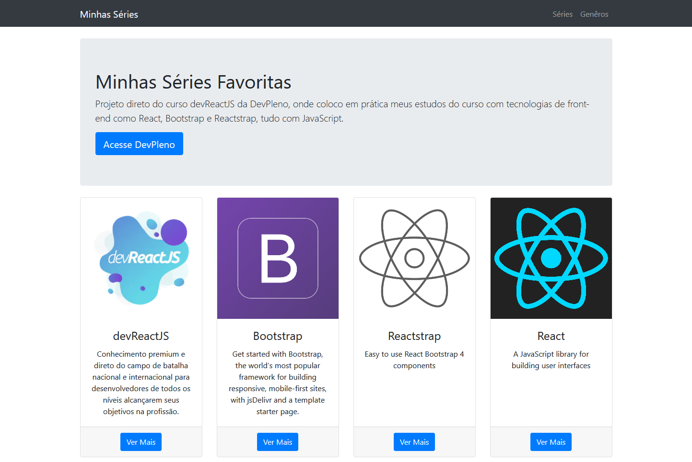
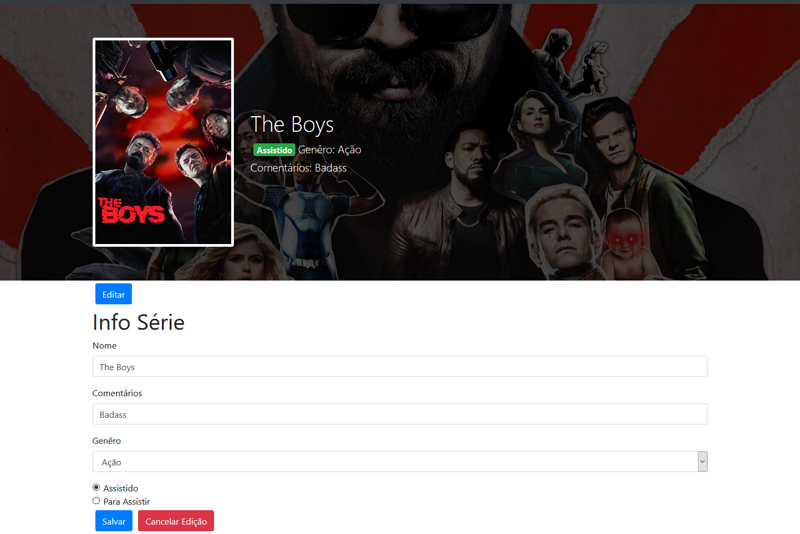

# Minhas Séries

Projeto do curso devReactJS, onde coloco em prática meus estudos do curso com tecnologias de front-end como React(conceitos iniciais props, hooks, components), Bootstrap e Reactstrap, tudo com JavaScript.

# Instalação

`git clone https://github.com/patrick-fv/minhas-series.git`

`yarn install`

`yarn start-react && yarn start-server`
